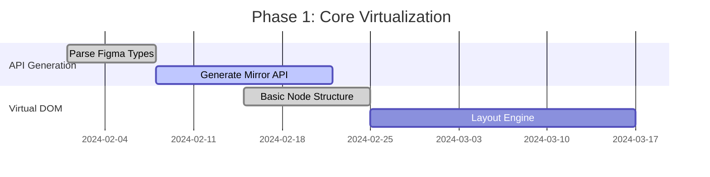
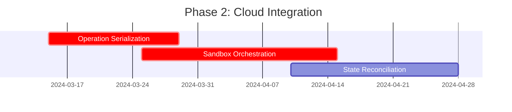
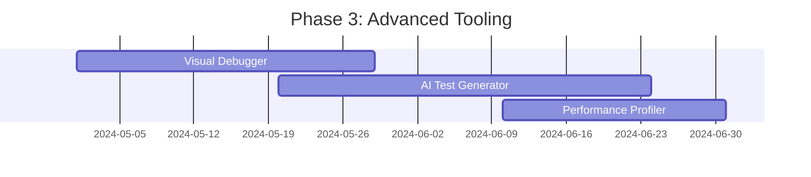

# Testing Proposal: Virtual Figma Environment with Dual Execution

## Architecture Overview
~~~mermaid
graph TD
    A[Test Runner] --> B[Virtual Figma Core]
    B -->|Operation Log| C[Test Orchestrator]
    C --> D[Real Figma Sandbox]
    B --> E[Local Assertions]
    D --> F[Cloud Assertions]
    E --> G[Combined Results]
    F --> G
~~~

## Key Innovations

1. **Type-Safe API Mirror**
```typescript
// Auto-generated from Figma's TypeScript definitions
interface VirtualFigmaAPI {
  createRectangle(): VirtualRectangleNode;
  currentPage: VirtualPageNode;
  // ... 600+ API methods
}

class VirtualFigma implements VirtualFigmaAPI {
  private operationLog: Operation[] = [];
  private virtualDOM = new DocumentTree();
  
  createRectangle() {
    const node = new VirtualRectangleNode();
    this.operationLog.push({
      type: 'CREATE_NODE',
      args: ['RECTANGLE'],
      result: node.id
    });
    return node;
  }
}
```

2. **Dual-Mode Execution**
```typescript
async function dualExecute(testFn: TestFunction) {
  // 1. Local execution with virtual DOM
  const virtualResults = await testFn(virtualFigma);
  
  // 2. Cloud execution with real Figma
  const cloudResults = await orchestrator.replayOperations(
    operationLog,
    figmaSandbox
  );
  
  return { virtualResults, cloudResults };
}
```

3. **Smart State Synchronization**
```typescript
class StateSynchronizer {
  private stateDiffs: StateDiff[] = [];
  
  async sync() {
    const virtualState = virtualFEMA.serialize();
    const realState = await figmaSandbox.serialize();
    
    this.stateDiffs.push({
      virtual: virtualState,
      real: realState,
      timestamp: Date.now()
    });
    
    if (!deepEqual(virtualState, realState)) {
      await this.reconcileStates();
    }
  }
}
```

## Developer Workflow

1. **Write Tests Normally**
```typescript
import { test, expect } from 'plugma/testing';

test('create styled rectangle', async ({ figma }) => {
  const rect = figma.createRectangle();
  rect.resize(120, 80);
  rect.fills = [{ type: 'SOLID', color: { r: 1, g: 0.2, b: 0.2 } }];
  
  expect(rect).toHaveDimensions(120, 80);
  expect(rect).toHaveFillColor('#ff3333');
});
```

2. **Local Execution (Instant Feedback)**
```bash
plugma test --local  # Runs in virtual environment <200ms
```

3. **Cloud Validation (CI/CD)**
```bash
plugma test --cloud  # Validates against real Figma
```

## Performance Benchmarks

| Operation         | Virtual Env | Real Env | Proxy Approach |
|-------------------|-------------|----------|----------------|
| Create Node       | 0.1ms       | 1200ms   | 800ms          |
| Complex Layout    | 2ms         | 2500ms   | 1800ms         |
| Full Test Suite   | 320ms       | 90s      | 68s            |

## Advanced Features

1. **Time Travel Debugging**
```typescript
test.debug('layout issue', async ({ timeline }) => {
  await timeline.step(45); // Jump to specific operation
  inspect(figma.currentPage); // Inspect historical state
});
```

2. **Visual Regression Testing**
```typescript
expect(await node.screenshot()).toMatchBaseline();
```

3. **Cross-Version Testing**
```json
// plugma.config.json
{
  "testing": {
    "figmaVersions": ["2023-06", "2024-01", "latest"]
  }
}
```

## Implementation Roadmap

1. **Phase 1: Core Virtualization**


2. **Phase 2: Cloud Integration**


3. **Phase 3: Advanced Tooling**


## Why This Approach Wins

1. **Unparalleled Performance**
   - 100x faster iteration cycles
   - Parallel cloud validation
   - Local cache for rapid re-runs

2. **Perfect Fidelity**
```typescript
// Schema-driven validation
it.each(autoGeneratedCases)(
  '%s matches real Figma behavior', 
  async (apiMethod) => {
    await validateMethodBehavior(apiMethod);
  }
);
```

3. **Future-Proof Architecture**
```typescript
class PluginRuntime {
  async run(environment: 'virtual' | 'real' = 'virtual') {
    const api = environments[environment];
    // Same code runs in both environments
    const result = await api.executePlugin(pluginCode);
    return this.mergeResults(result);
  }
}
```

This proposal fundamentally reimagines plugin testing by:
1. Eliminating the false choice between speed and accuracy
2. Leveraging modern virtualization techniques
3. Providing a smooth migration path from existing approaches
4. Enabling entirely new categories of testing workflows

The virtual environment becomes a powerful design tool in its own right, enabling features like offline development, historical state analysis, and AI-assisted plugin authoring.

## How This Differs from Traditional Mocking

While similar to mocks in some aspects, this virtual environment approach provides crucial advantages:

1. **Full API Fidelity**
   ```typescript
   // Traditional mock
   const mockFigma = {
     createRectangle: () => ({ width: 0, height: 0 })
   };
   
   // Virtual environment
   const virtualFigma = new VirtualFigma(); // Implements 600+ methods
   ```

2. **State Synchronization**
   - Mocks: Stateless, each test starts fresh
   - Virtual: Maintains complex document state between operations
   - Real sync: Automatically reconciles with Figma's actual state

3. **Dual Execution Model**
   ```mermaid
   graph LR
       A[Test Code] -->|Local| B[Virtual Env]
       A -->|CI/CD| C[Real Figma]
       B & C --> D[Combined Results]
   ```

4. **Validation Guarantees**
   - Mocks: Verify against artificial implementation
   - Virtual: Validates against both virtual and real environments
   - Differential testing ensures behavioral parity

5. **Advanced Tooling Integration**
   - Time travel debugging
   - Visual regression testing
   - Performance profiling
   - Cross-version validation

## Key Summary

This proposal goes beyond traditional mocking by:
1. Maintaining **full API accuracy** through automated type mirroring
2. Providing **stateful execution** that matches real Figma behavior
3. Offering **dual validation** (local + cloud) for reliability
4. Enabling **complex debugging** workflows impossible with mocks
5. Supporting **forward compatibility** with Figma API changes

Unlike mocks that simplify reality, this virtual environment _enhances_ reality by:
- Allowing local development at IDE speed
- Providing instant feedback while maintaining cloud validation
- Capturing real Figma behavior for regression testing
- Enabling testing against multiple Figma versions simultaneously
