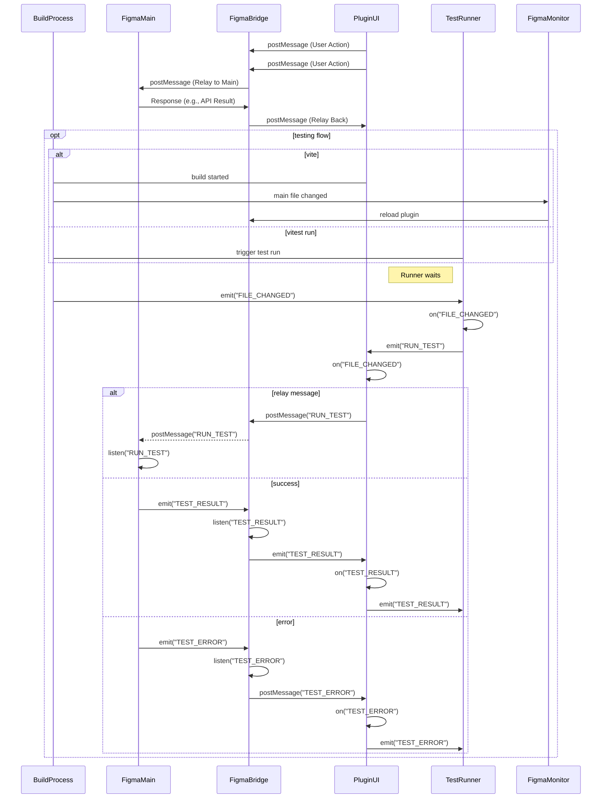

```mermaid
sequenceDiagram
    participant BuildProcess
    participant FigmaMain
    participant FigmaBridge
    participant PluginUI
    participant TestRunner
    participant FigmaMonitor

    PluginUI->>FigmaBridge: postMessage (User Action)
    PluginUI->>FigmaBridge: postMessage (User Action)
    FigmaBridge->>FigmaMain: postMessage (Relay to Main)
    FigmaMain->>FigmaBridge: Response (e.g., API Result)
    FigmaBridge->>PluginUI: postMessage (Relay Back)

    opt testing flow
        alt vite
            BuildProcess->PluginUI: build started
            BuildProcess->>FigmaMonitor: main file changed
            FigmaMonitor->>FigmaBridge: reload plugin
        else vitest run
            BuildProcess->TestRunner: trigger test run
        end

        note left of TestRunner: Runner waits
        BuildProcess->>TestRunner: emit("FILE_CHANGED")

        TestRunner->>TestRunner: on("FILE_CHANGED")
        TestRunner->>PluginUI: emit("RUN_TEST")

        PluginUI->>PluginUI: on("FILE_CHANGED")

        alt relay message
            PluginUI->>FigmaBridge: postMessage("RUN_TEST")
            FigmaBridge-->>FigmaMain: postMessage("RUN_TEST")
            FigmaMain->>FigmaMain: listen("RUN_TEST")
        else success
            FigmaMain->>FigmaBridge: emit("TEST_RESULT")
            FigmaBridge->>FigmaBridge: listen("TEST_RESULT")
            FigmaBridge->>PluginUI: emit("TEST_RESULT")
            PluginUI->>PluginUI: on("TEST_RESULT")
            PluginUI->>TestRunner: emit("TEST_RESULT")
        else error
            FigmaMain->>FigmaBridge: emit("TEST_ERROR")
            FigmaBridge->>FigmaBridge: listen("TEST_ERROR")
            FigmaBridge->>PluginUI: postMessage("TEST_ERROR")
            PluginUI->>PluginUI: on("TEST_ERROR")
            PluginUI->>TestRunner: emit("TEST_ERROR")
        end
    end
```
