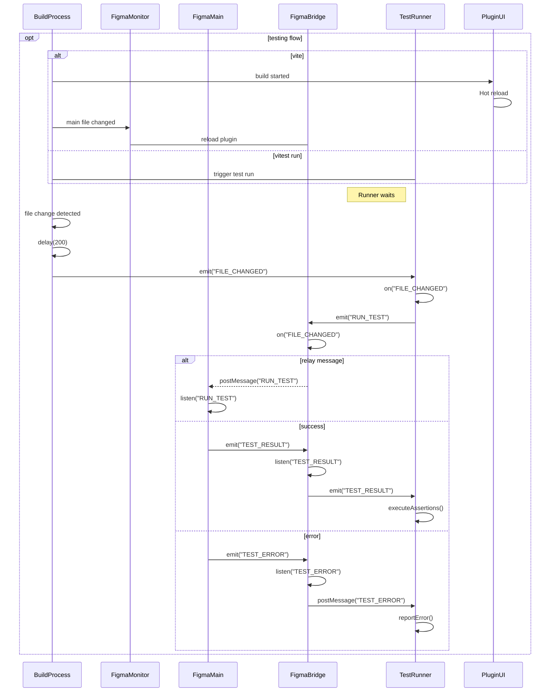

```mermaid
sequenceDiagram
    participant BuildProcess
    participant FigmaMonitor
    participant FigmaMain
    participant FigmaBridge
    participant TestRunner
    participant PluginUI

    opt testing flow
        alt vite
            BuildProcess->>PluginUI: build started
            PluginUI->PluginUI: Hot reload
            BuildProcess->>FigmaMonitor: main file changed
            FigmaMonitor->FigmaBridge: reload plugin
        else vitest run
            BuildProcess->TestRunner: trigger test run
        end

        note left of TestRunner: Runner waits
        BuildProcess->>BuildProcess: file change detected
        BuildProcess->>BuildProcess: delay(200)
        BuildProcess->>TestRunner: emit("FILE_CHANGED")

        TestRunner->>TestRunner: on("FILE_CHANGED")
        TestRunner->>FigmaBridge: emit("RUN_TEST")

        FigmaBridge->>FigmaBridge: on("FILE_CHANGED")

        alt relay message

            FigmaBridge-->>FigmaMain: postMessage("RUN_TEST")
            FigmaMain->>FigmaMain: listen("RUN_TEST")
        else success
            FigmaMain->>FigmaBridge: emit("TEST_RESULT")
            FigmaBridge->>FigmaBridge: listen("TEST_RESULT")
            FigmaBridge->>TestRunner: emit("TEST_RESULT")
            TestRunner->>TestRunner: executeAssertions()
        else error
            FigmaMain->>FigmaBridge: emit("TEST_ERROR")
            FigmaBridge->>FigmaBridge: listen("TEST_ERROR")
            FigmaBridge->>TestRunner: postMessage("TEST_ERROR")
            TestRunner->>TestRunner: reportError()
        end
    end

```
