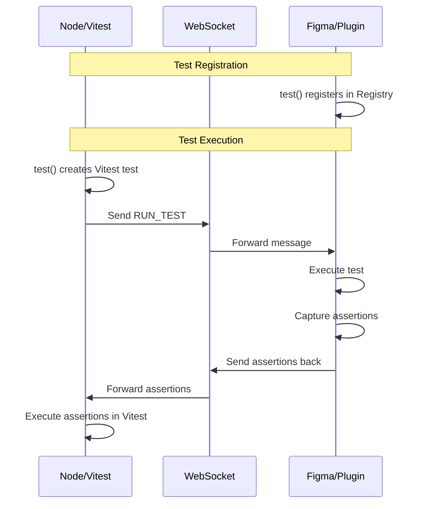
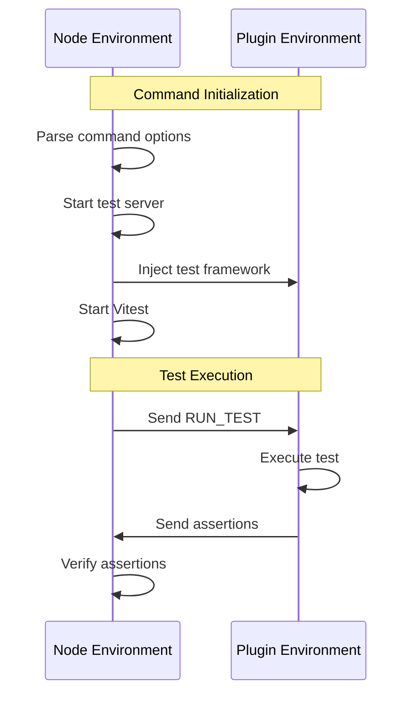

# Test Command

The test command enables running tests for Figma plugins by bridging the Node.js and Figma environments through WebSocket communication. It provides a Vitest-based testing framework that allows writing and running tests that interact with the Figma API.

## Dual-Environment Execution

The test framework operates in two environments simultaneously:

1. **Node Environment (Terminal)**:
   - Test files are executed by Vitest
   - The `test` function creates a Vitest test
   - Sends test execution messages to Figma
   - Receives and executes assertions

2. **Figma Environment (Plugin)**:
   - Tests are registered in a registry
   - Test functions execute in Figma context
   - Assertions are captured and sent back
   - Results are sent to Node via WebSocket



## Implementation Details

### Test Function

The `test` function behaves differently based on the environment:

```typescript
export const test = async (name, fn) => {
  // In Figma: Register the test
  if (typeof figma !== 'undefined') {
    registry.register(name, fn);
    return;
  }

  // In Node: Create a Vitest test
  return vitestTest(name, config, async () => {
    // Send test to Figma
    // Wait for assertions
    // Execute in Vitest
  });
};
```

### Assertion Capture

Assertions are captured in Figma using a Proxy:

```typescript
const expect = (value) =>
  new Proxy(
    {},
    {
      get: (_, prop) => {
        // Record assertion chain
        return proxy;
      },
      apply: (_, __, args) => {
        // Generate assertion code
        currentTest.assertions.push(code);
      },
    },
  );
```

### Message Protocol

```typescript
type TestMessage =
  | { type: 'RUN_TEST'; testName: string; testRunId: string }
  | { type: 'TEST_ASSERTIONS'; testRunId: string; assertions: string[] }
  | { type: 'TEST_ERROR'; testRunId: string; error: string };
```

## Usage Example

```typescript
import { test, expect } from 'plugma/testing';

test('creates a rectangle', () => {
  const rect = figma.createRectangle();
  expect(rect.type).toBe('RECTANGLE');
});
```

When this test runs:

1. In Figma: The test is registered in the registry
2. In Node: Vitest executes the test file
3. Node sends a RUN_TEST message to Figma
4. Figma executes the test and captures assertions
5. Assertions are sent back to Node
6. Node executes the assertions in Vitest

## Technical Details

### Command Implementation

The command provides:

1. A Vite plugin that injects the test framework
2. WebSocket server for communication
3. Vitest configuration for test execution

### Framework Injection

The test framework is injected via a Vite plugin that:

1. Creates a virtual module for `plugma/testing`
2. Includes the dual-environment test function
3. Provides the assertion capture system
4. Sets up WebSocket communication

## Command Implementation

### Core Components

```
src/
├── commands/test/
│   ├── index.ts           # Command entry point
│   ├── types.ts           # Command & message types
│   └── test-runner/       # Core testing functionality
│       ├── ws-client.ts   # WebSocket client
│       ├── registry.ts    # Test registry
│       └── expect.ts      # Assertion handling
└── tasks/test/
    ├── inject-test-code.ts  # Code injection
    ├── start-test-server.ts # Server connection
    └── run-vitest.ts        # Test execution
```

### Command Flow



## Tasks

### 1. `InjectTestCodeTask`

Injects the test framework into the plugin's code:

```typescript
// Plugin code before
export default function() {
  // Plugin code
}

// Plugin code after
import { setupTestRunner } from 'plugma/testing/runner';

export default function() {
  if (process.env.NODE_ENV === 'test') {
    setupTestRunner();
  }
  // Plugin code
}
```

### 2. `StartTestServerTask`

Connects to the core WebSocket server with test-specific handling:

```typescript
interface StartTestServerResult {
  client: TestClient;
}

const startTestServer = async (options: PluginOptions) => {
  const client = testClient.getInstance();
  await client.connect();
  return { client };
};
```

### 3. `RunVitestTask`

Configures and executes Vitest with plugin-specific settings:

```typescript
const runVitest = async (options: PluginOptions) => {
  const config = {
    test: {
      environment: 'figma',
      setupFiles: ['plugma/testing/setup'],
      include: options.testMatch,
    },
  };
  await startVitest(config);
};
```

## Test Framework Internals

### Message Protocol

```typescript
type TestMessage =
  | { type: 'RUN_TEST'; testName: string; testRunId: string }
  | { type: 'TEST_RESULT'; testRunId: string; passed: boolean }
  | { type: 'TEST_ASSERTIONS'; testRunId: string; assertions: string[] }
  | { type: 'TEST_ERROR'; testRunId: string; error: string };
```

### Assertion Capture

The framework uses a Proxy to capture assertions and convert them to executable code:

```typescript
class ExpectProxy {
  private assertions: string[] = [];

  expect<T>(actual: T) {
    return new Proxy(
      {},
      {
        get: (_, prop) => {
          const serialized = this.serialize(actual);
          this.assertions.push(`expect(${serialized}).${String(prop)}`);
        },
      },
    );
  }

  private serialize(value: unknown): string {
    // Handle Figma nodes and special types
    if (value instanceof FigmaNode) {
      return `{type:"${value.type}",id:"${value.id}"}`;
    }
    return JSON.stringify(value);
  }
}
```

### Test Registration

Tests are stored in a registry and executed on demand:

```typescript
class TestRegistry {
  private tests = new Map<string, TestFunction>();

  register(name: string, fn: TestFunction) {
    this.tests.set(name, fn);
  }

  async execute(name: string, context: TestContext) {
    const test = this.tests.get(name);
    if (!test) throw new Error(`Test not found: ${name}`);

    try {
      await test(context);
    } catch (error) {
      throw new TestError(name, error);
    }
  }
}
```

## Dependencies

The command relies on these core dependencies:

1. **Core WebSocket Server** (`ws-server.cts`):
   - Handles all WebSocket communication
   - Used by test client via `?source=test` parameter
   - No test-specific modifications needed

2. **Vitest**:
   - Used for test execution and reporting
   - Custom environment setup for Figma
   - Modified globals for plugin context

3. **Plugin Build System**:
   - Used for code injection
   - Handles test file discovery
   - Manages test environment setup

## Technical Limitations

1. **Test Isolation**:
   - Tests run sequentially due to shared plugin state
   - No parallel execution support
   - Manual cleanup required

2. **Assertion Handling**:
   - Limited to serializable values
   - Complex objects need manual serialization
   - Async assertions require special handling

3. **Plugin State**:
   - No automatic state reset between tests
   - Manual cleanup through test hooks
   - Potential state leakage between tests
