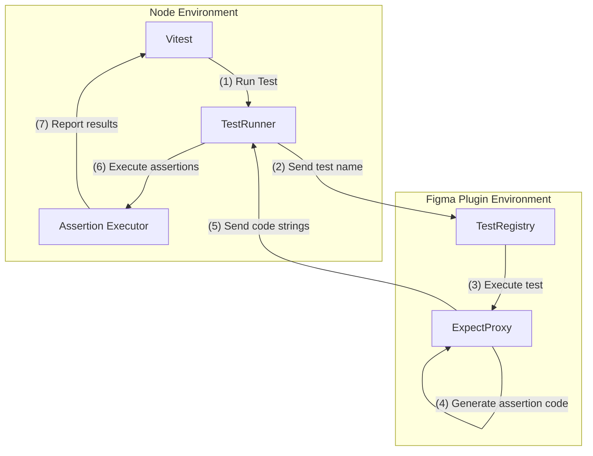
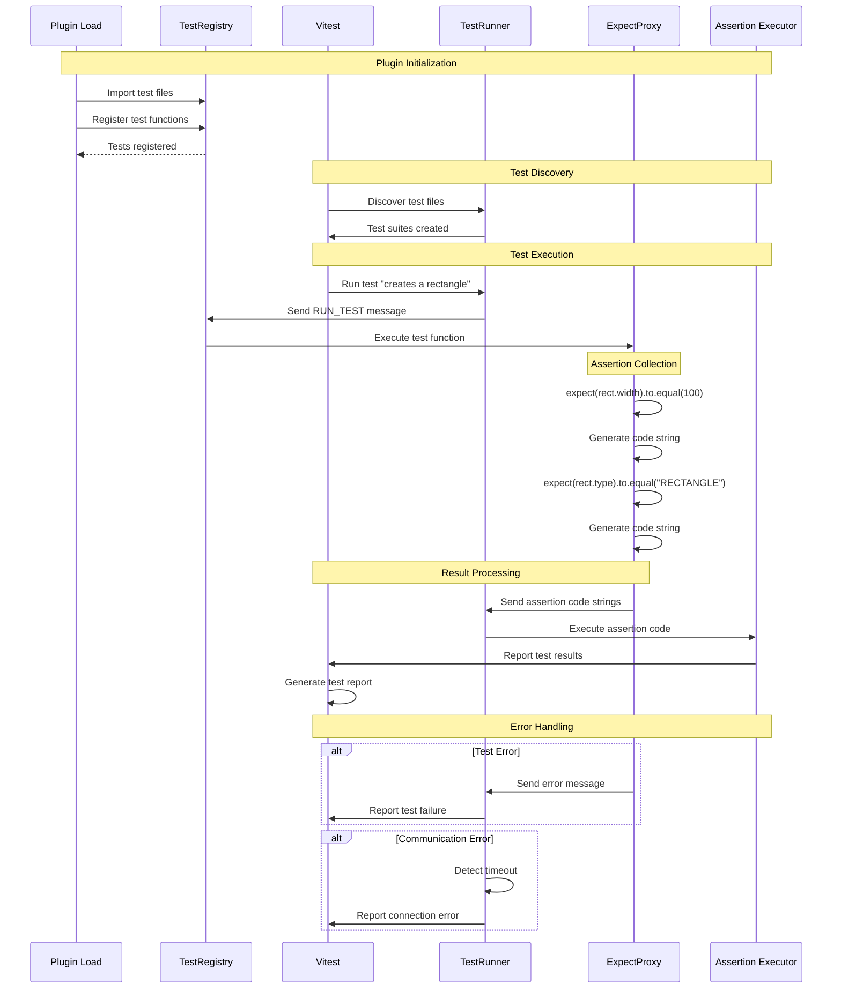

# How Plugma Testing Works

This document provides a detailed technical explanation of how the Plugma testing framework works internally.

## Key Components

### TestRegistry
- Maintains map of test names to functions
- Handles test registration and lookup
- Manages test execution context

### ExpectProxy

- Provides Chai-like assertion API
- Generates executable code strings
- Handles value serialization

The `expect` proxy is a **generic** proxy that accepts any function call and property access. It captures the call or prop access and generates a code string that can be executed in the Node environment, with the parameters passed to functions resolved to their values.

This is necessary because the Node environment does not have access to the Figma environment, so we need to generate the code strings in a way that can be executed without the variables being referenced and still produce the same results.

### TestRunner
- Bridges Vitest and Figma
- Manages WebSocket communication
- Executes assertion code
- 
## Architecture Overview

The testing framework operates across two environments simultaneously:
1. **Node Environment**: Where Vitest runs and manages test execution
2. **Figma Environment**: Where the actual tests execute and interact with the Figma API



## Complete Test Flow



## Step-by-Step Process

### 1. Test Registration
**Module**: `TestRegistry` (`test-registry.ts`)
- When plugin loads, all test files are imported
- Each `test()` call registers the test function in the registry
- Tests are stored with unique names for later execution

### 2. Test Discovery
**Module**: `TestRunner` (`test-runner.ts`)
- Vitest discovers test files in the project
- For each test file, it creates a test suite
- The runner connects to Figma via WebSocket

### 3. Test Execution
**Module**: `TestRegistry` & `ExpectProxy`
1. Node sends test name to Figma
2. Figma looks up and executes the test function
3. During execution, assertions are captured by ExpectProxy
4. Each assertion generates executable code strings

Example:
```ts
// In test
expect(rect.width).to.equal(100)

// Generated code string
"expect(100).to.equal(100)"
```

### 4. Result Processing
**Module**: `TestRunner`
1. Code strings are sent back to Node
2. Each assertion string is executed in Node's context
3. Results are reported through Vitest

## Communication Protocol

### Messages from Node to Figma
```ts
interface RunTestMessage {
  type: "RUN_TEST";
  testName: string;
}
```

### Messages from Figma to Node
```ts
interface TestCompleteMessage {
  type: "TEST_ASSERTIONS";
  assertions: string[];  // Array of assertion code strings
}

interface TestErrorMessage {
  type: "TEST_ERROR";
  error: string;
}
```

## Error Handling

1. **Test Execution Errors**
   - Caught in Figma
   - Error message sent to Node
   - Reported through Vitest

2. **Communication Errors**
   - Timeout handling
   - Connection recovery
   - Test cancellation

3. **Assertion Errors**
   - Invalid assertions caught during generation
   - Execution errors in Node context
   - Detailed error reporting

## Performance Considerations

1. **Message Size**
   - Only essential code strings transmitted
   - No complex object serialization
   - Efficient string-based communication

2. **Test Isolation**
   - Each test gets fresh context
   - Plugin state preserved between tests
   - Resources cleaned up after each test

3. **Concurrency**
   - Tests run sequentially in Figma
   - Multiple test files can run in parallel in Node
   - Communication is synchronized

## Debugging Support

1. **Code Inspection**
   - Generated code is human-readable
   - Easy to debug assertion strings
   - Clear error messages

2. **State Inspection**
   - Plugin state snapshots
   - Communication logs
   - Assertion execution logs

3. **Error Context**
   - Stack traces preserved
   - Plugin state at failure
   - Generated code history

## Future Improvements

1. **Test Isolation**
   - Automatic plugin state reset
   - Resource tracking and cleanup
   - Better error isolation
   - Proper test context object
   - State cleanup between test runs
   - Validation of test names and functions

2. **Performance**
   - Parallel test execution in Figma
   - Smarter test scheduling
   - Reduced communication overhead
   - Message queuing for WebSocket
   - More performant assertion chain collection

3. **Developer Experience**
   - Better error messages
   - Live test feedback
   - IDE integration
   - Visual test results
   - Configurable debug logging
   - Comprehensive API documentation
   - Helper utility functions
   - Configuration system with defaults

4. **Reliability**
   - Better error recovery
   - Connection resilience
   - Test retry support
   - Proper timeout handling
   - Comprehensive async scenario handling
   - Improved error propagation

   > Note: Test cancellation is not feasible in this architecture due to the one-way nature of WebSocket communication between Node and Figma's sandbox environment. While we can send messages to cancel a test, we cannot guarantee the test will actually stop executing in the sandbox.

5. **Type Safety**
   - Proper Chai type extensions
   - Complete message type definitions
   - Type-safe message handling
   - Better test context typing
   - Elimination of any types

6. **Architecture**
   - Lifecycle hooks (before/after)
   - Clear initialization sequence
   - Better module organization
   - Private internal modules
   - Proper error boundaries
   - Robust object serialization
